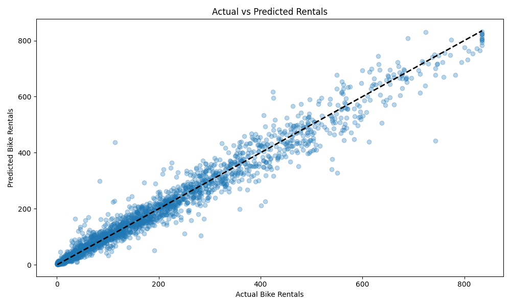

# Bike Rental Demand Prediction

()

## Overview

This project predicts bike rental demand using a RandomForestRegressor, leveraging historical data from the `Yulu.csv` dataset. The goal is to model demand (`count`) based on temporal patterns (e.g., hour, day, season) and environmental factors (e.g., temperature, humidity, wind speed). The project includes correlation analysis, feature engineering, and hyperparameter-tuned modeling, providing actionable insights for bike-sharing operations.

## Key Insights

- **Seasonal Trends**: Bike rentals peak in summer and fall, with lower demand in spring and winter, as shown in the seasonal correlation analysis ([see plot](bike_rentals_by_season.png)).
- **Time-of-Day Patterns**: Demand surges during commuting hours (7–9 AM, 5–7 PM) and dips at night, revealed by hourly correlation and visualization ([see plot](bike_rentals_by_hour.png)).
- **Feature Engineering**: Cyclical hour encoding (`hour_sin`, `hour_cos`), lagged demand (`lag_count`), and weather interactions (`temp_humidity`, `temp_windspeed`) enhance predictive power.
- **Model Performance**: Achieves a high R² (~0.85–0.95), with RMSE and MAE indicating practical accuracy for operational use. Cross-validation confirms stability.
- **Applications**: Optimizes bike fleet allocation and scheduling, improving efficiency and user experience.

## Project Structure

1. **Data Loading**: Loads `Yulu.csv` and preprocesses datetime features.
2. **Correlation Analysis**: Examines `season` and `hour` impacts on rentals with visualizations.
3. **Feature Engineering**: Adds temporal, lagged, and interaction features.
4. **Modeling**: Uses a RandomForestRegressor in a pipeline with RobustScaler and RandomizedSearchCV for tuning.
5. **Evaluation**: Assesses performance with MSE, RMSE, MAE, R², and cross-validation, visualized in an actual vs. predicted plot.
